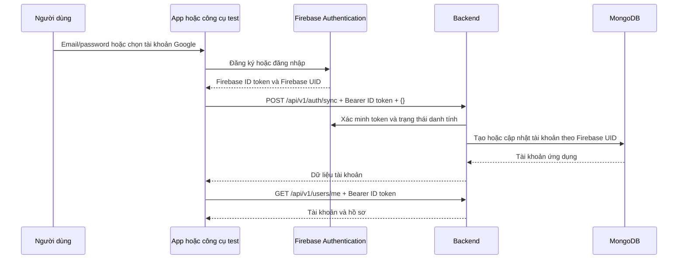

# Hướng dẫn đăng ký và đăng nhập Vegeta

Tài liệu hướng dẫn luồng email/password và Google, cách test bằng Git Bash hoặc trình duyệt, và cách xem dữ liệu sau khi đăng nhập. Các công cụ test nằm trong thư mục `be_project`, bên ngoài repository backend `vegan-api-mma302`.

## 1. Firebase và backend có nhiệm vụ gì?

| Thành phần              | Nhiệm vụ                                                                      |
| ----------------------- | ----------------------------------------------------------------------------- |
| Firebase Authentication | Tạo danh tính, xác thực email/password hoặc Google, cấp Firebase ID token.    |
| Backend Vegeta          | Xác minh Firebase ID token, tạo/đồng bộ tài khoản ứng dụng và kiểm tra quyền. |
| MongoDB                 | Lưu tài khoản ứng dụng, hồ sơ, vai trò, trạng thái và dữ liệu nghiệp vụ.      |

Backend hiện không có API `/auth/register` hoặc `/auth/login` nhận mật khẩu. Hai phương thức đều dùng cùng API backend sau khi Firebase xác thực:

| API                      | Mục đích                                                                     |
| ------------------------ | ---------------------------------------------------------------------------- |
| `POST /api/v1/auth/sync` | Tạo hoặc đồng bộ tài khoản MongoDB bằng danh tính trong token. Body là `{}`. |
| `GET /api/v1/users/me`   | Xem tài khoản, hồ sơ và hồ sơ dinh dưỡng của người đang đăng nhập.           |
| `GET /api/v1/auth/me`    | Xem thông tin tổng hợp tài khoản đang đăng nhập.                             |



Nếu Firebase đã tạo tài khoản nhưng `/auth/sync` thất bại, hãy đăng nhập tài khoản đó và gọi lại `/auth/sync`. Không đăng ký lại cùng email. Đồng bộ lặp lại cùng Firebase UID không tạo tài khoản trùng.

## 2. Những thông tin cần chuẩn bị

| Thông tin            | Ví dụ hoặc nơi lấy                                                                                                     |
| -------------------- | ---------------------------------------------------------------------------------------------------------------------- |
| Địa chỉ backend      | `https://vegan-api.ngocthang.io.vn` hoặc `http://localhost:3000`. Không thêm `/api-docs`, `/api/v1` hoặc dấu `/` cuối. |
| Firebase project     | Phải cùng project mà backend sử dụng. Project hiện đang hướng dẫn là `vegeta-app-fdd29`.                               |
| Firebase Web API Key | Trường `apiKey` trong cấu hình ứng dụng Web tại Project settings → General → Your apps.                                |
| Email/password       | Thông tin tài khoản muốn đăng ký hoặc đăng nhập.                                                                       |
| Firebase ID token    | Nhận sau khi Firebase xác thực; gửi trong header `Authorization: Bearer ...`.                                          |

Phân biệt các giá trị:

| Giá trị                     | Dùng ở đâu?                                                                                               |
| --------------------------- | --------------------------------------------------------------------------------------------------------- |
| Firebase API key            | Client SDK hoặc tham số `key` khi gọi Firebase REST API. Không dùng thay Bearer token.                    |
| Google OAuth client ID      | Cấu hình luồng Google Sign-In phía client. Không phải Firebase API key.                                   |
| Google ID/access token      | Kết quả từ Google; SDK chuyển credential Google sang phiên Firebase. Không gửi trực tiếp vào backend này. |
| Firebase ID token           | Token backend yêu cầu. Khi dùng Firebase SDK, lấy từ Firebase user sau khi đăng nhập thành công.          |
| Service account private key | Bí mật cấu hình Firebase Admin tại backend; không đưa vào FE hoặc trang test.                             |

Backend cần chạy được và kết nối MongoDB. Nếu chạy local, mở terminal trong thư mục backend và chạy:

```bash
cd /d/document/FPT/7_Semester/MMA/be_project/vegan-api-mma302
npm run dev
```

Backend yêu cầu Node.js 24 trở lên, dependency đã cài và `.env` hợp lệ. Nếu dùng backend đã deploy, không cần chạy backend local.

Kiểm tra readiness:

```bash
BASE_URL='https://vegan-api.ngocthang.io.vn'
curl -i "${BASE_URL}/api/v1/health/ready"
```

Kết quả mong đợi: HTTP 200, `success: true`, `data.status: ready` và `data.database: connected`. Readiness không thay thế việc kiểm tra đăng nhập Firebase.

## 3. Đăng ký bằng email/password

### 3.1. Bật Email/Password trong Firebase

1. Mở Firebase Console và chọn đúng project.
2. Vào Security → Authentication. Nếu chưa khởi tạo, bấm Get started.
3. Mở Sign-in method → Email/Password.
4. Bật Email/Password và Save.

### 3.2. Flow trên ứng dụng

1. Người dùng nhập email/password, bấm Đăng ký.
2. FE gọi Firebase SDK để tạo tài khoản.
3. Firebase trả Firebase user; FE lấy Firebase ID token.
4. FE gọi `POST /api/v1/auth/sync` với token và body `{}`.
5. Backend tạo tài khoản nếu chưa có: `role: user`, `status: active`, `onboardingCompleted: false`.
6. FE nhận tài khoản rồi mở onboarding để người dùng hoàn thiện hồ sơ.

Mật khẩu được gửi tới Firebase Authentication; backend này không nhận hoặc lưu mật khẩu đăng nhập.

### 3.3. Test nhanh bằng file `.sh`

Mở `../test-register-account.sh` và kiểm tra các dòng đầu:

```bash
FIREBASE_API_KEY='YOUR_FIREBASE_WEB_API_KEY'
BASE_URL='https://vegan-api.ngocthang.io.vn'
EMAIL='YOUR_EMAIL'
PASSWORD=''
```

Thay API key và email bằng giá trị của bạn. Để `PASSWORD=''` thì script hỏi mật khẩu khi chạy; ký tự nhập không hiển thị trên terminal. Nếu test local, thay BASE_URL bằng `http://localhost:3000`.

Chạy trong Git Bash:

```bash
cd /d/document/FPT/7_Semester/MMA/be_project
bash test-register-account.sh
```

Script cần `curl` và `node`, không cần `jq`. Các bước tự chạy:

1. Kiểm tra readiness backend.
2. Đăng ký Firebase qua `accounts:signUp`.
3. Lấy token và gọi `/api/v1/auth/sync`.
4. Gọi `/api/v1/users/me` và hiển thị dữ liệu.

Nếu script thất bại sau khi Firebase đã đăng ký thành công, dùng chế độ đăng nhập ở mục 4.

### 3.4. Test thủ công bằng curl

Khai báo trong Git Bash:

```bash
FIREBASE_API_KEY='YOUR_FIREBASE_WEB_API_KEY'
BASE_URL='https://vegan-api.ngocthang.io.vn'
```

Đổi email/password mẫu trong body rồi chạy:

```bash
curl -i -X POST \
  "https://identitytoolkit.googleapis.com/v1/accounts:signUp?key=${FIREBASE_API_KEY}" \
  -H 'Content-Type: application/json' \
  --data-raw '{
    "email": "your-test-account@example.com",
    "password": "ReplaceWithYourTestPassword2026!",
    "returnSecureToken": true
  }'
```

Thành công thì Firebase trả `email`, `localId` (Firebase UID), `idToken`, `refreshToken` và `expiresIn`. Copy toàn bộ giá trị **idToken**, không copy dấu ngoặc kép hoặc refreshToken:

```bash
TOKEN='YOUR_FIREBASE_ID_TOKEN'
```

Đồng bộ vào backend:

```bash
curl --fail-with-body -i -X POST \
  "${BASE_URL}/api/v1/auth/sync" \
  -H "Authorization: Bearer ${TOKEN}" \
  -H 'Content-Type: application/json' \
  --data-raw '{}'
```

Đọc tài khoản:

```bash
curl --fail-with-body -i \
  "${BASE_URL}/api/v1/users/me" \
  -H "Authorization: Bearer ${TOKEN}"
```

Body `{}` của `/auth/sync` không nhận email, mật khẩu hoặc role. Backend lấy danh tính từ token đã xác minh.

## 4. Đăng nhập bằng email/password

### 4.1. Flow

1. Người dùng nhập email/password của tài khoản đã có.
2. FE gọi Firebase SDK đăng nhập; khi test REST dùng `accounts:signInWithPassword`.
3. Firebase cấp ID token mới.
4. FE gọi `/auth/sync` để đồng bộ và cập nhật thông tin đăng nhập.
5. FE gọi các API có xác thực bằng token đó.

### 4.2. Dùng script đã có

Giữ cùng API key, BASE_URL và email trong script, sau đó chạy:

```bash
cd /d/document/FPT/7_Semester/MMA/be_project
bash test-register-account.sh signin
```

Script đăng nhập thay vì tạo tài khoản, rồi đồng bộ và đọc tài khoản như khi đăng ký.

### 4.3. Dùng curl

```bash
curl -i -X POST \
  "https://identitytoolkit.googleapis.com/v1/accounts:signInWithPassword?key=${FIREBASE_API_KEY}" \
  -H 'Content-Type: application/json' \
  --data-raw '{
    "email": "your-test-account@example.com",
    "password": "ReplaceWithYourTestPassword2026!",
    "returnSecureToken": true
  }'
```

Lấy `idToken` mới, cập nhật biến TOKEN rồi chạy hai lệnh backend ở mục 3.4. Phải dùng email/password thật của tài khoản đã tạo, không giữ giá trị mẫu.

## 5. Đăng ký và đăng nhập bằng Google

Google không yêu cầu người dùng tạo mật khẩu riêng cho ứng dụng. Lần xác thực Google đầu tiên có thể tạo Firebase user; các lần sau đăng nhập lại cùng danh tính. Backend tạo hay cập nhật tài khoản theo Firebase UID khi nhận `/auth/sync`.

```text
Bấm Đăng nhập Google
→ Google mở màn hình chọn tài khoản và xác thực
→ Firebase SDK đăng nhập Firebase bằng credential Google
→ Lấy Firebase ID token từ Firebase user
→ POST /api/v1/auth/sync
→ GET /api/v1/users/me
```

### 5.1. Bật Google provider

1. Firebase Console → Authentication → Sign-in method.
2. Chọn Google, bật Enable.
3. Điền Public-facing name, ví dụ `Vegeta`.
4. Chọn Support email của bạn hoặc nhóm.
5. Bấm Save và kiểm tra Google có trạng thái Enabled.

Khi dùng cấu hình Firebase thông thường của cùng project, chưa cần điền Safelist client IDs from external projects. Firebase quản lý cấu hình OAuth của provider; không dùng service account `client_id` thay cho Web OAuth client ID.

### 5.2. Cho phép trang test localhost

Firebase Console → Authentication → Settings → Authorized domains → Add domain:

```text
localhost
```

Chỉ nhập tên domain; không thêm `http://`, port hoặc đường dẫn. Project Firebase tạo sau ngày 28/04/2025 có thể không có localhost mặc định. Chỉ dùng cấu hình này cho mục đích test cục bộ phù hợp; cấu hình domain triển khai riêng khi làm FE thật.

### 5.3. Chạy trang test trên trình duyệt của bạn

Trong Git Bash:

```bash
cd /d/document/FPT/7_Semester/MMA/be_project
node test-google-login-server.mjs
```

Giữ terminal chạy, mở Chrome hoặc Edge và nhập:

```text
http://localhost:8088
```

**Không bấm đúp vào `test-google-login.html` để đăng nhập.** Trang phải chạy qua HTTP server, không phải địa chỉ `file:///...`.

Điền các ô:

| Ô                    | Giá trị                                                                                          |
| -------------------- | ------------------------------------------------------------------------------------------------ |
| Firebase Web API Key | `apiKey` trong cấu hình Web của đúng project.                                                    |
| Firebase Project ID  | `vegeta-app-fdd29`, nếu backend vẫn dùng project này.                                            |
| Firebase authDomain  | `vegeta-app-fdd29.firebaseapp.com`, hoặc giá trị authDomain thực tế trong cấu hình Firebase Web. |
| Địa chỉ backend      | `http://localhost:3000` hoặc `https://vegan-api.ngocthang.io.vn`.                                |

Bấm **Đăng nhập bằng Google**, cho phép popup nếu trình duyệt chặn, chọn tài khoản và hoàn thành xác thực. Công cụ hiển thị email, displayName, Firebase UID và đoạn lệnh Bash đã chứa Firebase ID token.

### 5.4. Đồng bộ Google user vào backend

1. Bấm **Copy lệnh Bash** trên trang.
2. Mở Git Bash thứ hai; không dừng terminal đang chạy server trang test.
3. Dán và chạy toàn bộ đoạn lệnh.
4. Kiểm tra `/auth/sync` và `/users/me` trả thành công.

Trang chỉ đăng nhập Firebase và chuẩn bị lệnh. Tài khoản MongoDB được tạo hoặc cập nhật khi bạn thực sự chạy lệnh `/auth/sync`.

Test xong, đóng trang và nhấn Ctrl+C ở terminal chạy server. Nếu port 8088 đã được dùng bởi server test đang chạy, mở địa chỉ localhost ở trên; nếu là chương trình khác, dừng hoặc đổi port chương trình đó trước.

### 5.5. Khi triển khai trong Android

1. Đăng ký ứng dụng Android trong cùng Firebase project, nhập đúng applicationId/package name của app.
2. Trong thư mục dự án Android, chạy `./gradlew signingReport` bằng Git Bash và lấy SHA-1 của bản debug để test. Thêm fingerprint cho các bản release khi triển khai bản ký tương ứng.
3. Thêm SHA-1 vào Project settings → Your apps → ứng dụng Android → SHA certificate fingerprints.
4. Sau khi bật Google và thêm fingerprint, tải lại `google-services.json`, đặt vào module `app/`.
5. FE tích hợp Firebase Auth và Google Sign-In qua Credential Manager. Khi API yêu cầu serverClientId, dùng Web OAuth client ID theo hướng dẫn Firebase, không thay bằng Android client ID hoặc Firebase API key.
6. Sau khi Firebase sign-in thành công, lấy Firebase ID token rồi gọi backend như các flow trên.

Backend vẫn dùng Firebase Admin của project hiện tại; không cần thêm Android API key vào `.env` backend. Test trang Web không xác nhận rằng cấu hình package name, fingerprint và Google Sign-In của Android đã hoàn tất.

### 5.6. Email trùng giữa hai phương thức

Nếu đăng nhập Google báo `auth/account-exists-with-different-credential`, email có thể đã gắn với phương thức khác. Luồng xử lý là đăng nhập phương thức hiện có trước, rồi liên kết credential Google bằng Firebase SDK. Không tự ghép hai Firebase UID khác nhau dựa vào email trong MongoDB, và không xóa tài khoản để xử lý lỗi này.

## 6. Xem dữ liệu tài khoản ở đâu?

### Firebase Console

Authentication → Users: xem email, UID, provider và thời điểm liên quan đến xác thực.

### MongoDB Atlas

Browse Collections → database được cấu hình bởi `MONGODB_DB_NAME` → collection `users`. Lọc theo email:

```json
{ "email": "your-test-account@example.com" }
```

Hoặc Firebase UID:

```json
{ "firebaseUid": "YOUR_FIREBASE_UID" }
```

Firebase UID khác với MongoDB `_id`/`userId`. Dữ liệu hồ sơ mở rộng nằm ở collection `userProfiles`; các module khác có collection riêng.

### API backend

`GET /api/v1/users/me` trả envelope dạng sau; đây là ví dụ rút gọn, không phải toàn bộ schema:

```json
{
  "success": true,
  "data": {
    "user": {
      "userId": "MONGODB_USER_ID",
      "email": "your-test-account@example.com",
      "role": "user",
      "status": "active",
      "onboardingCompleted": false
    },
    "profile": null,
    "nutritionProfile": null
  },
  "meta": {
    "requestId": "REQUEST_ID"
  }
}
```

`profile` và `nutritionProfile` có thể null khi người dùng chưa hoàn thiện hồ sơ. Điều này không có nghĩa là đăng ký thất bại.

## 7. Token và việc đăng nhập lại

- Firebase ID token có thời hạn; kiểm tra `expiresIn` trong kết quả REST. Kết quả test thường là 3600 giây.
- Khi test thủ công, đăng nhập lại để lấy ID token mới rồi cập nhật TOKEN. Biến Bash không tự gia hạn token.
- Trên FE thật, Firebase SDK quản lý phiên và gia hạn; lấy ID token còn hiệu lực trước khi gửi request. Chỉ ép refresh khi cần, thay vì ép trên mọi request.
- Không gửi refreshToken vào backend. Không lưu ID token vào Git hoặc tài liệu hướng dẫn.
- Khi đóng terminal, các biến Bash không còn. Khai báo lại cấu hình và đăng nhập nếu muốn test tiếp.

## 8. Lỗi thường gặp

| Lỗi hoặc hiện tượng                                    | Cách kiểm tra và xử lý                                                                                      |
| ------------------------------------------------------ | ----------------------------------------------------------------------------------------------------------- |
| Firebase `EMAIL_EXISTS`                                | Dùng signin thay vì signup cho email đã có.                                                                 |
| Firebase `OPERATION_NOT_ALLOWED`                       | Bật provider Email/Password hoặc Google đang sử dụng.                                                       |
| Firebase `CONFIGURATION_NOT_FOUND`                     | Khởi tạo Authentication và kiểm tra API key thuộc đúng project.                                             |
| API key không hợp lệ                                   | Lấy lại Firebase Web API Key; không dùng private_key, client_id hoặc project number.                        |
| Sai email/password hoặc `INVALID_LOGIN_CREDENTIALS`    | Kiểm tra thông tin đăng nhập; không đăng ký lại tài khoản đã có.                                            |
| Google `auth/unauthorized-domain`                      | Thêm localhost vào Authorized domains và dùng `http://localhost:8088`.                                      |
| Google `auth/popup-blocked`                            | Cho phép popup cho localhost rồi thử lại.                                                                   |
| Google `auth/popup-closed-by-user`                     | Mở lại flow và hoàn thành chọn tài khoản.                                                                   |
| Google `auth/account-exists-with-different-credential` | Đăng nhập phương thức cũ và liên kết Google bằng Firebase SDK.                                              |
| Trang không tải được Firebase SDK                      | Kiểm tra Internet, quyền truy cập gstatic.com và tải lại trang.                                             |
| Trang đang mở bằng file://                             | Khởi động server Node và mở localhost qua Chrome/Edge.                                                      |
| Port 8088 đang được sử dụng                            | Kiểm tra server test đã chạy hay chưa; tránh khởi động hai bản cùng port.                                   |
| Backend `TOKEN_MISSING`                                | Thêm header Authorization: Bearer TOKEN.                                                                    |
| Backend `TOKEN_INVALID` hoặc `TOKEN_EXPIRED`           | Lấy Firebase ID token mới của đúng project, không gửi Google token hoặc refreshToken.                       |
| Backend `ACCOUNT_NOT_SYNCED`                           | Gọi POST /auth/sync thành công trước khi gọi /users/me.                                                     |
| Backend từ chối tài khoản suspended/deleted            | Kiểm tra trạng thái tài khoản; không tự đổi role/status từ client.                                          |
| curl `(56) Connection was reset`                       | Kết nối bị ngắt; xem log backend/restart/mạng. Nếu Firebase đã tạo tài khoản, đăng nhập lại rồi retry sync. |
| Có Firebase user nhưng MongoDB chưa có                 | Hoàn thành bước /auth/sync; Firebase không tự ghi tài khoản vào MongoDB của backend này.                    |

Khi báo lỗi, ghi lại bước lỗi, HTTP status, mã lỗi và requestId nếu có. Không gửi mật khẩu, private key, ID token hoặc refreshToken trong ảnh/log chia sẻ.

## 9. Checklist hoàn thành

- [ ] Provider tương ứng đã Enabled trong đúng Firebase project.
- [ ] Backend readiness trả HTTP 200.
- [ ] Firebase đăng ký/đăng nhập thành công và cấp Firebase ID token.
- [ ] POST /api/v1/auth/sync trả thành công.
- [ ] GET /api/v1/users/me trả HTTP 200 và dữ liệu tài khoản.
- [ ] Firebase Console có đúng user/provider.
- [ ] MongoDB có tài khoản ứng dụng tương ứng, nếu có quyền xem database.
- [ ] FE xử lý lỗi và cho phép thử lại sync mà không đăng ký lại email.

## 10. Công cụ và tài liệu tham khảo

- [Script đăng ký/đăng nhập email-password](../test-register-account.sh).
- [Trang test Google Login](../test-google-login.html) — phải chạy qua HTTP server.
- [Server trang test Google](../test-google-login-server.mjs).
- [Cấu hình backend](../vegan-api-mma302/README.md).
- [Firebase Auth REST API](https://firebase.google.com/docs/reference/rest/auth).
- [Email/password trên Web](https://firebase.google.com/docs/auth/web/password-auth).
- [Google Login trên Web](https://firebase.google.com/docs/auth/web/google-signin).
- [Google Login trên Android](https://firebase.google.com/docs/auth/android/google-signin).
- [Firebase API keys](https://firebase.google.com/docs/projects/api-keys).
- [Firebase Authentication troubleshooting](https://firebase.google.com/docs/auth/faq-and-troubleshooting).
